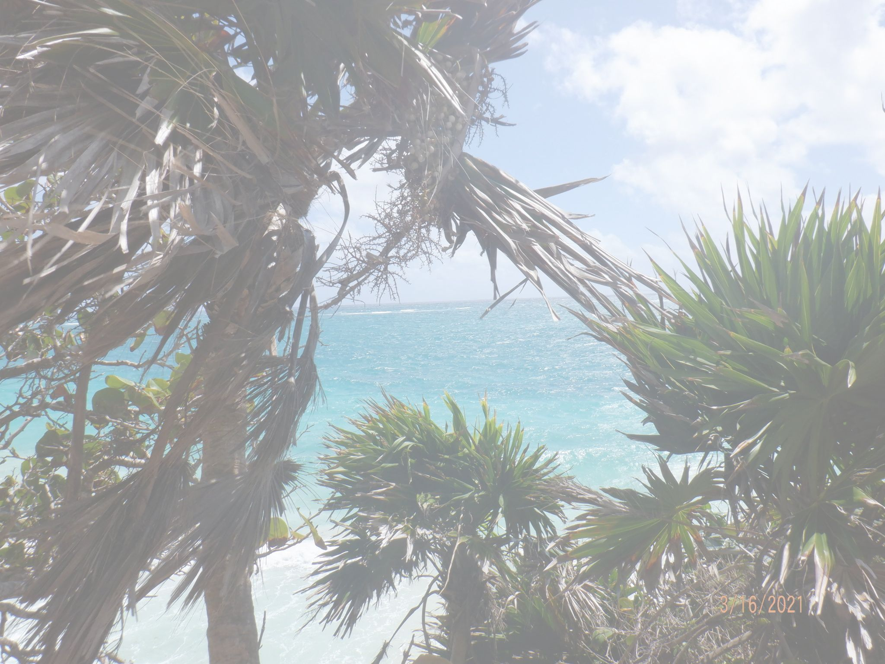

# Weather App

## Description

- My motivation was to create a weather app that displays current a 5-day forecast
built this project to help me with API's and continuation of using moment
- It solves the problem of not knowing this week's weather forecast, useful when traveling
- I learned how to use API's and how o fix their bug's

## Usage

Provide instructions and examples for use. Include screenshots as needed.

To add a screenshot, create an `assets/images` folder in your repository and upload your screenshot to it. Then, using the relative filepath, add it to your README using the following syntax:

## Credits

the following tutorials gave me differnet ideas for my weather App:

- https://www.youtube.com/watch?v=GXrDEA3SIOQ
- https://www.youtube.com/watch?v=6trGQWzg2AI

## License

MIT License

## Features

This app lets you see the forecast for the next 5 days, just enter your city.
